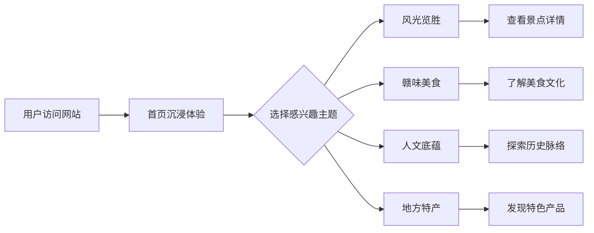

# 江西介绍网站 - 产品需求文档 (PRD)

## 1. 产品概述
一款面向地域分享者和旅游爱好者的江西省综合性介绍网站，以沉浸式视觉体验展示江西的自然风光、人文历史、特色美食与地方特产。
- 目标用户：对江西文化感兴趣的游客、学生、研究者及地域文化传播者
- 核心价值：通过精美的视觉设计与丰富的内容呈现，让用户全面了解江西的独特魅力

## 2. 核心功能

### 2.1 用户角色
| 角色 | 访问方式 | 核心权限 |
|------|----------|----------|
| 访客 | 直接访问 | 浏览所有内容、查看详情 |

### 2.2 功能模块
1. **首页 (Home)**: 全屏 Hero 展示、核心景点快速入口、数据概览
2. **风光览胜 (Scenery)**: 江西名山大川与名胜古迹的图文展示
3. **赣味美食 (Cuisine)**: 江西特色美食与饮食文化的详细介绍
4. **人文底蕴 (Culture)**: 历史文化、红色文化、非遗传承等内容
5. **地方特产 (Specialties)**: 江西各地特色产品推荐

### 2.3 页面详情
| 页面名称 | 模块名称 | 功能描述 |
|-----------|----------|----------|
| 首页 | Hero 区域 | 全屏沉浸式背景，融合江西山水意象，配合动态文字入场动画 |
| 首页 | 快速导航卡片 | 四大主题模块的精美卡片入口，悬浮交互效果 |
| 首页 | 数据概览区 | 以可视化方式展示江西关键数据（景区数量、非遗项目数等） |
| 首页 | 精选推荐轮播 | 轮播展示精选景点/美食/文化亮点 |
| 风光览胜 | 景点网格展示 | 瀑布流或网格布局展示各景点卡片，含图片、名称、简介 |
| 风光览胜 | 景点详情弹窗 | 点击展开详细信息，含高清大图、位置、历史背景 |
| 赣味美食 | 美食分类标签 | 按类型分类（小吃、正餐、特产食品等）筛选切换 |
| 赣味美食 | 美食卡片列表 | 展示美食图片、名称、产地、特色描述 |
| 人文底蕴 | 时间轴展示 | 以时间轴形式展现江西历史文化发展脉络 |
| 人文底蕴 | 文化专题板块 | 红色文化、陶瓷文化、书院文化等分块展示 |
| 地方特产 | 产品展示墙 | 网格式产品卡片，含图片、名称、产地、特点说明 |

## 3. 核心流程
用户进入网站 → 首页全屏动画吸引注意力 → 通过导航栏或快速入口选择感兴趣的主题 → 在对应页面浏览详细内容 → 可点击查看更多详情信息

## 4. 用户界面设计

### 4.1 设计风格
- **主色调**: 青绿山水色 (#1a5f4a) + 朱砂红 (#c23a3a) 作为强调色，灵感源自江西山水与红色文化
- **辅助色**: 宣纸米白 (#f5f0e8) 为底色，水墨灰 (#4a4a4a) 为文字色
- **按钮风格**: 圆角胶囊状按钮，微渐变质感，悬浮时轻微上浮+阴影加深
- **字体**: 标题使用「霞鹜文楷」(LXGW WenKai) 或「思源宋体」，正文使用系统优雅中文字体栈
- **布局风格**: 单页滚动式为主，各板块通过视差滚动自然过渡
- **装饰元素**: 水墨晕染效果、山水剪影、传统纹样点缀、毛笔笔触分隔线

### 4.2 页面设计概览
| 页面名称 | 模块名称 | UI 元素 |
|-----------|----------|---------|
| 首页 | Hero 区域 | 全屏山水意境背景图 + 渐变遮罩 + 大标题「赣鄱大地」逐字显现 + 副标题淡入 + 向下滚动提示动画 |
| 首页 | 快速导航 | 四张圆角大卡片（山水/美食/文化/特产），每张配代表性背景图 + 图标 + 名称，hover 时图片缩放 + 光晕扩散 |
| 首页 | 数据概览 | 四个数据指标横向排列，数字从0跳动到目标值，配合简洁图标和说明文字 |
| 首页 | 精选推荐 | 横向滚动卡片组，自动轮播 + 手动拖拽，卡片含图片、标题、简短描述 |
| 风光览胜 | 页头 | 大标题 + 水墨风格装饰线 + 简短引言 |
| 风光览胜 | 景点网格 | 不规则瀑布流布局，卡片带圆角阴影，图片占满卡片上半部分，下方为名称和一句话介绍 |
| 赣味美食 | 分类标签栏 | 横向可滑动标签组，选中状态高亮显示，点击平滑过渡切换内容 |
| 赣味美食 | 美食卡片 | 左图右文或上图下文卡片，食物特写图片 + 名称 + 产地标签 + 口感描述 |
| 人文底蕴 | 时间轴 | 垂直居中时间轴线，左右交替排列历史事件节点，节点处圆形标记 + 年份 + 事件描述 |
| 人文底蕴 | 专题板块 | 各文化主题以大卡片形式横向排列，每个卡片有独特的配色和图标 |
| 地方特产 | 产品展示 | 均匀网格布局，产品卡片含图片、名称、产地徽章、特点标签 |

### 4.3 响应式设计
- 桌面端优先设计 (Desktop-first)
- 平板端 (768px-1024px): 调整网格列数，保持整体布局结构
- 移动端 (<768px): 单列布局，导航折叠为汉堡菜单，触摸友好的交互区域
