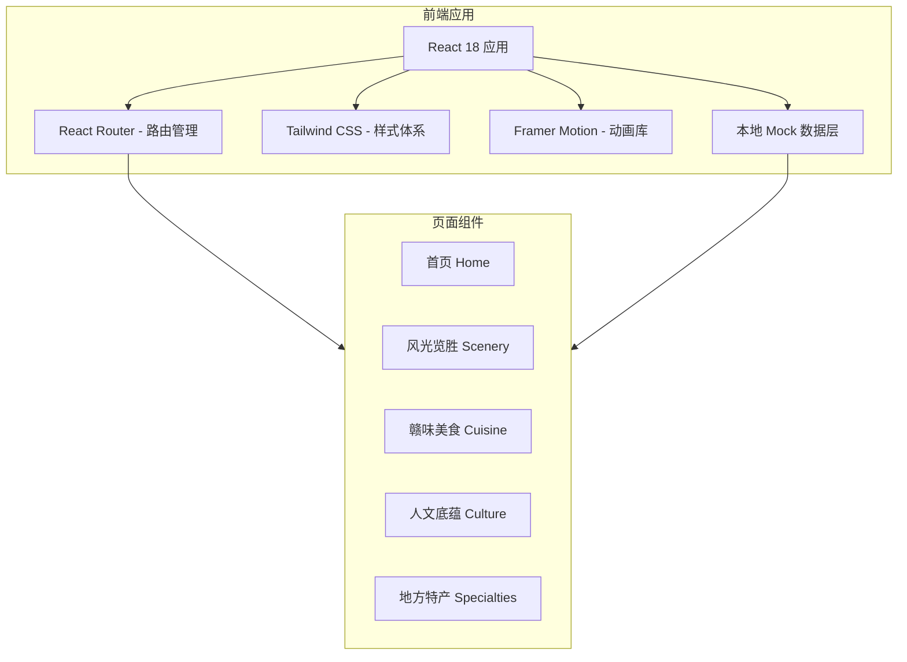

# 江西介绍网站 - 技术架构文档

## 1. 架构设计



## 2. 技术选型
- **前端框架**: React@18 + Vite
- **样式方案**: Tailwind CSS@3 (支持自定义设计令牌)
- **动画方案**: Framer Motion (页面转场、元素进场、滚动触发动画)
- **路由管理**: React Router v6
- **图标方案**: Lucide React (轻量级图标库)
- **字体方案**: Google Fonts 引入霞鹜文楷 / 思源宋体
- **构建工具**: Vite (快速开发服务器与优化构建)
- **数据方案**: 本地 JSON Mock 数据 (无需后端服务)

## 3. 路由定义
| 路由路径 | 页面名称 | 功能说明 |
|----------|----------|----------|
| `/` | 首页 | Hero 展示 + 快速导航 + 数据概览 + 精选推荐 |
| `/scenery` | 风光览胜 | 江西名胜古迹展示与详情 |
| `/cuisine` | 赣味美食 | 江西特色美食分类展示 |
| `/culture` | 人文底蕴 | 历史文化与非遗展示 |
| `/specialties` | 地方特产 | 江西特色产品推荐 |

## 4. 项目目录结构
```
jiangxi-intro/
├── public/
│   └── images/              # 静态图片资源
├── src/
│   ├── assets/              # 样式资源、字体文件
│   ├── components/          # 公共可复用组件
│   │   ├── Layout/          # 布局组件 (Header, Footer, Navigation)
│   │   ├── ui/              # 基础 UI 组件 (Button, Card, Tag 等)
│   │   └── sections/        # 首页各区块组件
│   ├── data/                # Mock 数据文件 (JSON)
│   │   ├── scenery.json     # 景点数据
│   │   ├── cuisine.json     # 美食数据
│   │   ├── culture.json     # 文化数据
│   │   └── specialties.json # 特产数据
│   ├── pages/               # 页面组件
│   │   ├── Home.jsx
│   │   ├── Scenery.jsx
│   │   ├── Cuisine.jsx
│   │   ├── Culture.jsx
│   │   └── Specialties.jsx
│   ├── hooks/               # 自定义 Hooks
│   ├── App.jsx              # 应用根组件
│   ├── main.jsx             # 入口文件
│   └── index.css            # 全局样式 + Tailwind 配置
├── tailwind.config.js       # Tailwind 自定义配置
├── vite.config.js           # Vite 构建配置
└── package.json
```

## 5. 数据模型

### 5.1 景点数据 (scenery)
```json
{
  "id": "string",
  "name": "string",
  "location": "string",
  "description": "string",
  "detailDescription": "string",
  "image": "string",
  "tags": ["string"],
  "highlights": ["string"]
}
```

### 5.2 美食数据 (cuisine)
```json
{
  "id": "string",
  "name": "string",
  "category": "string",
  "origin": "string",
  "description": "string",
  "image": "string",
  "taste": "string"
}
```

### 5.3 文化数据 (culture)
```json
{
  "id": "string",
  "title": "string",
  "era": "string",
  "year": "string",
  "description": "string",
  "image": "string",
  "type": "string"
}
```

### 5.4 特产数据 (specialties)
```json
{
  "id": "string",
  "name": "string",
  "origin": "string",
  "category": "string",
  "description": "string",
  "image": "string",
  "features": ["string"]
}
```

## 6. 关键技术实现要点
- **CSS 变量系统**: 定义完整的色彩令牌体系，确保设计一致性
- **滚动动画**: 使用 Framer Motion 的 useInView + useScroll 实现视差和触发动画
- **图片优化**: 使用懒加载 + 占位符模糊效果提升性能
- **响应式断点**: sm:640px, md:768px, lg:1024px, xl:1280px
- **无障碍支持**: 语义化 HTML、合理的 ARIA 标签、键盘导航支持
